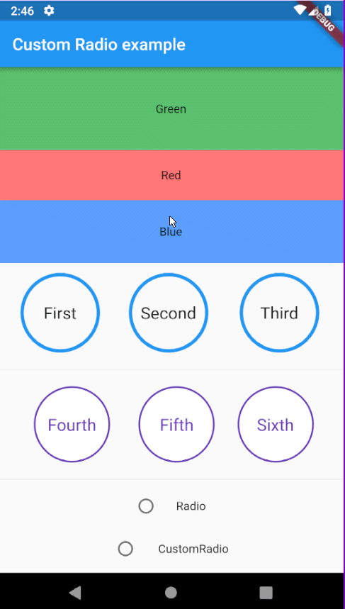

# custom_radio

An animatable radio button that can be customized to the max.

I found it strange that flutter only provides two radio widgets: __Radio__ and __RadioListTile__
The main issue with these widgets is that both of them force the use of the default Android leading animated circular icon.
This widget leaves everything up to the user by allowing them to provide their own builder function.
On top of that, an animations builder can also be provided. This gets passed a parent animation controller with which the user can then use to create a list of animations that can animate the widgets transition between states.

# Installation
Simply add `custom_radio: ^0.1.1` as a dependancy in your pubspec.yaml file.
Then `import 'package:custom_radio/custom_radio.dart';` wherever you need it.

# Example
```
import 'package:custom_radio/custom_radio.dart';
import 'package:flutter/material.dart';

void main() {
    runApp(MyApp());
}

class MyApp extends StatelessWidget {
    @override
    Widget build(BuildContext context) {
        return MaterialApp(
            title: 'Custom Radio demo',
            home: MyHomePage(title: 'Custom Radio example')
        );
    }
}

class MyHomePage extends StatefulWidget {
  MyHomePage({Key key, this.title}) : super(key: key);

  final String title;
  int radioValue = 0;

  @override
  State<MyHomePage> createState() => _MyHomePageState();

}

class _MyHomePageState extends State<MyHomePage> {

  _MyHomePageState() {
    customBuilder = (int value) {
      return ({ BuildContext context, List<dynamic> animValues, Function updateState, bool checked }) {
        return GestureDetector(
          onTap: () {
            setState(() {
              widget.radioValue = value;
            });
          },
          child: Container(
            width: double.infinity,
            height: animValues[0] * 50 + 80,
            color: animValues[1],
            child: Center(
              child: Text(
                value.toString()
              )
            ),
          ),
        );
      };
    };
  }

  dynamic customBuilder;

  @override
  Widget build(BuildContext context) {
    return Scaffold(
      appBar: AppBar(title: Text(widget.title)),
      body: Column(
        children: <Widget>[
          CustomRadio<int, dynamic>(
            value: 0,
            groupValue: widget.radioValue,
            duration: Duration(milliseconds: 800),
            animsBuilder: (AnimationController controller) => [
              CurvedAnimation(
                parent: controller,
                curve: Curves.ease,
              ),
              ColorTween(begin: Colors.greenAccent.withAlpha(200), end: Colors.green).animate(controller),
            ],
            builder: customBuilder(0)
          ),
          CustomRadio<int, dynamic>(
            value: 1,
            groupValue: widget.radioValue,
            duration: Duration(milliseconds: 800),
            animsBuilder: (AnimationController controller) => [
              CurvedAnimation(
                parent: controller,
                curve: Curves.ease,
              ),
              ColorTween(begin: Colors.redAccent.withAlpha(200), end: Colors.red).animate(controller),
            ],
            builder: customBuilder(1),
          ),
          CustomRadio<int, dynamic>(
            value: 2,
            groupValue: widget.radioValue,
            duration: Duration(milliseconds: 800),
            animsBuilder: (AnimationController controller) => [
              CurvedAnimation(
                parent: controller,
                curve: Curves.ease,
              ),
              ColorTween(begin: Colors.blueAccent.withAlpha(200), end: Colors.blue).animate(controller),
            ],
            builder: customBuilder(2),
          ),
        ],
      ),
    );
  }

}
```

